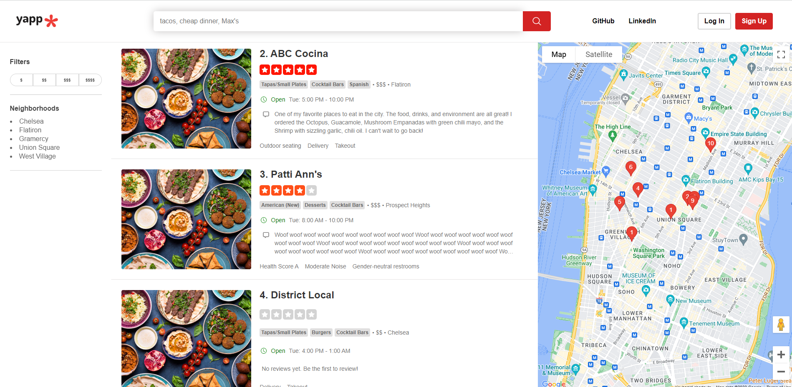
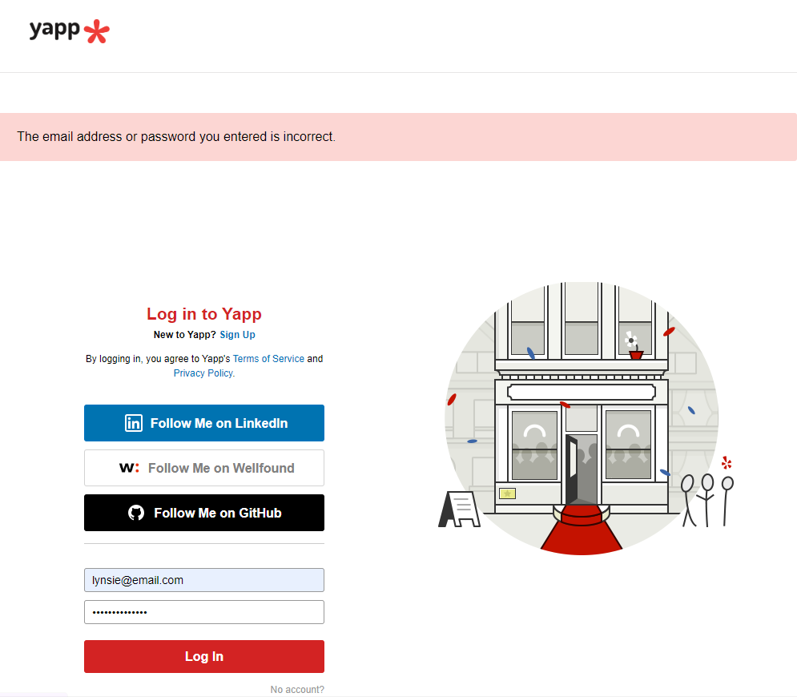
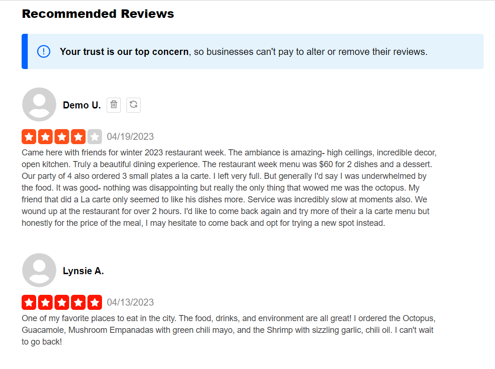
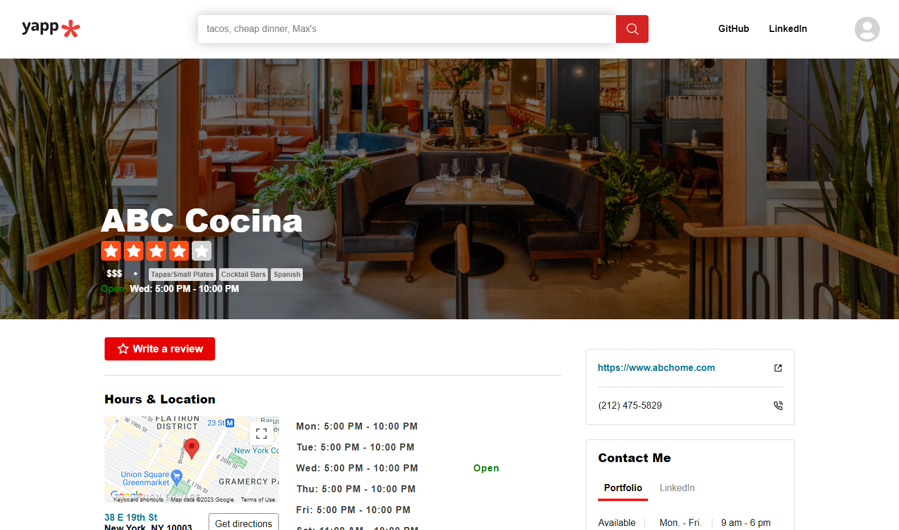

# README

# Yapp 

### Live link: https://yapp.onrender.com

## Background 
Yapp is a full stack clone of Yelp; it allows for a user to search for and review restaurants with full CRUD functionality. 
To write, update, and delete a review, a user must be signed in to their account. 

Yapp was developed using Ruby on Rails and PostgreSQL for its backend, and JavaScript, React, and Redux for its frontend.

## Functionality, Features, MVPs

Yapp has seven core features: 

1. User Authentication & Demo User Account
    - User can create their own account or Login as a Demo User

2. Restaurant reviews 
    - A logged in user has full CRUD capability 
    - A logged out user only has reading capability. If they click on "Write a Review" button, they will be redirected to login page.

3. Google Maps and restaurant location pins
    - Utilizes Google Maps API
    - Renders restaurant seed locations based on restaurant latitude and longitude
4. Search bar and filtering
    - User can search and filter by restaurant name, cuisine, price, or neighborhood
5. Restaurant Index page / Restaurant Show page 

6. Hosting on Render.com
    - https://yapp.onrender.com

7. Production ReadME

## Future Features

- Set up AWS
    - This will allow for: 
        - Independent restaurant banners and thumb nail images 
        - Upload review images 
- User Profile 
    - Will allow users to:
        - Update personal information
        - Access all user's reviews in one place
- Review Reactions
    - Will allow users to react to reviews, deciding if the review was useful, funny, or cool

## Technologies, Libraries, APIs

- Database: PostgreSQL
- Backend: Ruby on Rails
- Frontend: JavaScript, React, Redux, JSX, DOM Manipulation Vanilla JS, React Icons, Icons 8, Font Awesome 

